# Клиент и сетевой тракт EndlessNet

Status: active
Owner: platform

## Область документа

Документ описывает фактически работающий клиентский контур: регистрацию узла,
закрепление доверия к ключу подписи, получение network map, запуск WireGuard,
поиск прямого пути, relay fallback, offline-режим и управление долгоживущей
службой через локальный IPC.

Уровни зрелости здесь разделены явно:

- **реализовано** — код участвует в штатном клиентском или relay lifecycle;
- **задел** — типы, функции или отдельная команда существуют, но не включены в
  полный автоматический lifecycle;
- **направление** — предлагаемое развитие, которого в коде сейчас нет.

## Краткая схема

```mermaid
flowchart LR
    CLI["CLI или локальный UI"] --> IPC["Локальный service IPC"]
    IPC --> Agent["Долгоживущий agent"]
    Agent --> Enroll["Enrollment и node credential"]
    Enroll --> Trust["Закрепленный signing trust"]
    Trust --> Map["Подписанная network map"]
    Map --> WG["wireguard-go и TUN"]
    WG --> Bind["Общий MagicBind UDP socket"]
    Bind --> Relay["Relay-first путь"]
    Bind --> Probe["STUN и authenticated direct probes"]
    Probe --> Direct["Прямой WireGuard-путь"]
    Direct -. "две неудачные проверки" .-> Relay
```

Control plane сообщает желаемое состояние и подписанные endpoint candidates,
но не проксирует штатный прямой WireGuard-трафик. Relay переносит зашифрованные
WireGuard datagrams, когда прямой путь еще не найден или деградировал.

## Реализовано

### 1. Lifecycle: enrollment → trust → map → connect

Основной orchestration находится в
[`cmd/endlessnet-client/main.go`](../../cmd/endlessnet-client/main.go), а
control-plane client — в
[`internal/client/api.go`](../../internal/client/api.go).

1. Клиент создает отдельные Ed25519 identity-ключи и WireGuard-ключи. В запрос
   уходят публичные ключи; приватные остаются в локальном client state. Код
   форматов identity находится в
   [`internal/client/identity.go`](../../internal/client/identity.go),
   WireGuard-ключей — в
   [`internal/wgkeys`](../../internal/wgkeys).
2. Installation fingerprint привязывает сохраненное состояние к конкретной
   установке. Копирование того же state на другой хост завершается
   явным конфликтом, а не создает два устройства с одной identity; см.
   [`internal/client/device.go`](../../internal/client/device.go).
3. Enrollment выполняется по join token либо через browser approval flow.
   Успешный ответ связывается с исходным запросом: клиент повторно проверяет
   network/node ID, identity public key, WireGuard public key и fingerprint.
4. Клиент получает signing identity через публичный Gateway HTTPS либо через
   loopback Gateway в development. Private вызов Gateway → Signing в
   production всегда идет по SPIRE mTLS; прямого plaintext `/server-key` нет.
   Ответ обязан содержать три независимых trust bundle: map, node credential и
   relay. Клиент закрепляет map trust локально; Coordinator и relay используют
   принадлежащие им bundle без fallback на встроенный public key. Неожиданная
   смена активного map signing key переводит service workflow в состояние
   `ServerIdentityChanged` и требует явного подтверждения оператора.
5. Coordinator возвращает network map и отдельный node credential. Перед
   применением клиент валидирует структуру карты, registration binding,
   срок действия и Ed25519-подпись; реализация подписи находится в
   [`clientapi/v1/mapsign.go`](https://github.com/endless-net/blob/main/clientapi/v1/mapsign.go).
6. Проверенная карта преобразуется в WireGuard peers, routes, DNS и локальные
   policy-настройки и транзакционно применяется прямо к долгоживущему
   wireguard-go engine. Промежуточный конфигурационный файл в agent iteration
   не создается; `wg-quick`-совместимый файл доступен только через отдельную
   явную команду `endlessnet-client export`.
7. После первого snapshot агент ожидает map-stream события и revision
   checkpoints вместо постоянного короткого polling. При разрыве соединения
   используется экспоненциальная задержка с jitter и переключение между
   настроенными coordinator URLs.

Node credential версии 3 подписан Ed25519, связан с `network_id` и `node_id`,
имеет срок действия и scopes `node:register`, `node:map`, `node:endpoint`,
`node:delete`; см.
[`clientapi/v1/nodecredential.go`](https://github.com/endless-net/blob/main/clientapi/v1/nodecredential.go).
Он содержит `key_id`, но не public key: проверяющая сторона разрешает ключ
только из node credential trust bundle. Credential передается в заголовке
`X-EndlessNet-Node-Credential`, а пользовательская session — как bearer token.

### 2. Долгоживущий wireguard-go engine

Клиент использует Tailscale fork `wireguard-go` напрямую; реализация находится
в
[`internal/client/wireguard_engine.go`](../../internal/client/wireguard_engine.go).
Engine владеет TUN, UDP bind, platform router, relay bridge и path manager в
течение всего соединения.

TUN и UDP socket не пересоздаются при каждом control-plane обновлении. UAPI,
routes, DNS и policy применяются повторно только при изменении вычисленного
desired state. Это дает два подтвержденных реализацией свойства:

- STUN и path discovery видят тот же порт, которым пользуется WireGuard;
- смена карты не обязана кратковременно уничтожать уже поднятый dataplane.

В репозитории нет альтернативного native-kernel backend или флага выбора
backend. Поэтому документация и эксплуатация должны исходить именно из
жизненного цикла WireGuard engine.

### 3. MagicBind: один UDP socket для dataplane и discovery

[`internal/client/magicbind.go`](../../internal/client/magicbind.go) реализует
`conn.Bind` для wireguard-go. Один динамически выбранный порт обслуживает:

- обычные WireGuard datagrams;
- STUN Binding transactions, созданные самим bind;
- authenticated direct-path probes;
- loopback endpoint relay bridge.

MagicBind перехватывает только ответы на известные STUN transactions и path
probe frames; остальные datagrams передаются wireguard-go. IPv4 и IPv6 по
возможности открываются на одинаковом порту.

Практический смысл решения подтвержден самим трактом: адрес, полученный через
STUN, относится к реальному WireGuard socket, а не к отдельному временному
diagnostic socket. Поэтому опубликованный mapped endpoint пригоден для
последующего NAT traversal.

### 4. STUN и endpoint candidates

Client-only Binding protocol реализован в
[`internal/stunclient`](../../internal/stunclient). Он проверяет тип сообщения,
magic cookie, transaction ID, длины атрибутов и разбирает
`XOR-MAPPED-ADDRESS`. STUN listeners разрабатываются и выпускаются из отдельного
репозитория `endless-net/stun`; EndlessNet хранит только endpoint list и
клиентский Binding.

В automatic discovery публикуются:

1. успешный PCP или NAT-PMP mapping;
2. mapped addresses от доступных STUN endpoints;
3. подходящие локальные LAN addresses.

Автоматический port mapping включается только при наличии обычного IPv4 gateway
на маршруте к публичному STUN host. Сначала пробуется PCP, затем NAT-PMP.
Lease запрашивается на две минуты и обновляется на половине срока; после
неудачного цикла следующая попытка откладывается на пять минут. Это реализовано
в
[`internal/client/portmap_auto.go`](../../internal/client/portmap_auto.go).

Перед применением маршрутов клиент инвентаризирует локальные интерфейсы и
отклоняет overlay/advertised routes, пересекающиеся с уже существующими local
CIDR; см. [`internal/client/netcheck.go`](../../internal/client/netcheck.go).

### 5. Relay-first и переход на direct

Алгоритм выбора пути реализован в
[`internal/client/wireguard_relay.go`](../../internal/client/wireguard_relay.go):

1. Если relay доступен, каждый peer начинает через relay, пока direct
   candidates проверяются параллельно.
2. Discovery packets аутентифицируются ключом, выведенным из WireGuard X25519
   shared secret, и HMAC-SHA256. В запрос включены nonce и timestamp; старые
   запросы отклоняются. Детали — в
   [`internal/client/pathprobe.go`](../../internal/client/pathprobe.go).
3. Успешная проверка одновременно подтверждает обратную достижимость, открывает
   NAT path и измеряет RTT.
4. Выбирается лучший healthy direct candidate. Для смены уже рабочего пути
   требуется как минимум 10 мс и 20% улучшения, что уменьшает flapping.
5. После двух последовательных неудачных probes direct peer возвращается на
   relay, не ожидая следующего 30-секундного control-plane sync.
6. Relay connection остается поднятым и при активном direct path. Если relay
   отсутствует, используется лучший подписанный direct endpoint — relay не
   является обязательной зависимостью.

Именно наличие рабочего пути до окончания NAT discovery является
реализованным результатом relay-first. Это не означает, что relay всегда
предпочтительнее direct: успешный и более быстрый direct path продвигается в
рабочую конфигурацию автоматически.

### 6. Relay dataplane

Клиент принимает только `relay-v1-tls`, выбирает endpoints минимального priority,
параллельно измеряет TLS RTT и использует минимальный RTT. При разнице менее
10 ms применяется rendezvous hash по node ID. TLS 1.3 обязателен. После
аутентификации relay bridge создает loopback UDP
endpoint для каждого peer и пересылает WireGuard datagrams как ограниченные по
размеру JSON frames через одно relay-соединение; см.
[`internal/client/relaypath.go`](../../internal/client/relaypath.go) и
[`internal/client/relaybridge.go`](../../internal/client/relaybridge.go).

Relay runtime и `protocol/v1` находятся во внешнем private-репозитории
[`endless-net/relay`](https://github.com/endless-net/relay):

- relay credential связывает node и network и имеет срок действия;
- coordinator повторно подтверждает active-node state и допустимость peer
  frame по ACL;
- authoritative session определяется максимальным epoch для пары network/node;
- размер payload ограничен 64 KiB, bounded queues допускают drop при congestion;
- full mesh пересылает frame не более чем через один hop с at-most-once delivery;
- admission limits ограничивают общее число connections, concurrent auth и
  число connections с одного source address;
- есть counters/gauges для connections, auth, sessions, frames, bytes, drop
  reasons, slow consumers и graceful drain.

Public plaintext и старый unversioned protocol отклоняются. Выпуск и rollout
Relay выполняются только из внешнего репозитория.

### 7. Offline cache

После успешной проверки клиент атомарно сохраняет подписанную карту и revision.
Перед записью из нее удаляются `NodeCredential` и `RelayCredential`. При
offline-запуске клиент заново проверяет:

- локальные node/network identity;
- монотонность revision;
- срок и подпись карты;
- дополнительный `max-cache-age`, если оператор задал его.

Нулевой `max-cache-age` отключает только дополнительную проверку возраста;
срок действия самой подписанной карты продолжает проверяться. Подпись network
map по умолчанию выдается на 24 часа.

Следствие текущей реализации: после cold start без coordinator offline-кэш не
дает новый relay credential. Такой запуск может восстановить только доступный
direct path. Это security/availability граница, а не обещание полного offline
relay.

### 8. Конфигурация и локальная служба

[`internal/client/config_store.go`](../../internal/client/config_store.go)
сериализует изменения состояния внутри процесса и выполняет атомарную запись.
На всех платформах единственный формат —
`state_format: endlessnet-client-state`, `state_version: 1`; на Linux
единственный путь — `/var/lib/endlessnet/client.json`. Signing trust и
connection intent находятся в том же state. Рабочие CLI, IPC и agent не
поддерживают прежние схемы и возвращают `client_state_format_unsupported` или
`client_state_version_unsupported`.

State с иным форматом или версией не поддерживается и не преобразуется. После
архивирования такого state оператор повторяет login и enrollment/join. APT upgrade
сохраняет обычное поведение остановки и возобновления активного service, но не
обрабатывает содержимое client state.

На Unix файл с token, private keys или credentials должен иметь режим `0600` или
строже. На Windows state хранится только в machine-scoped DPAPI envelope
`endlessnet-client-state-dpapi-v1`;
plaintext и неизвестные protected-форматы отклоняются; см.
[`internal/client/config_protection_windows.go`](../../internal/client/config_protection_windows.go).

Локальный IPC использует protocol v2 (`current = min = 2`) и работает через
защищенный OS-local transport. Клиент обязательно передает protocol/current/min
headers; сервер выбирает максимальную версию пересечения диапазонов:

- Windows: `\\.\pipe\endlessnet-service`;
- Linux: `/run/endlessnet/client.sock`;
- macOS: `/var/run/endlessnet/client.sock`.

Контракт описан в
[`docs/client-ipc-v2.openapi.yaml`](../client-ipc-v2.openapi.yaml),
реализация — в
[`internal/client/service_ipc.go`](../../internal/client/service_ipc.go),
[`service_ipc_windows.go`](../../internal/client/service_ipc_windows.go) и
[`service_ipc_unix.go`](../../internal/client/service_ipc_unix.go).

Observer доступны status, поток изменившихся состояний, server identity и список
сетей. Первый пользователь, запускающий enrollment, фиксируется в защищённом
state как локальный владелец по Windows SID или Unix UID. Владелец и
administrator/root могут выполнять enroll, connect, disconnect, logout и выбор
сети, читать redacted diagnostics и recent logs, а также создавать bounded
diagnostics bundle; другому обычному пользователю IPC возвращает
`owner_required`. Доверие новому server identity и явный `POST /logout/local`
всегда требуют administrator/root. Обычный `POST /logout` сначала выполняет
bounded remote cleanup; если сервер не подтвердил revoke/delete, enrollment
сохраняется и UI может предложить отдельный local forget. Успешный ответ имеет
typed outcome `remote_cleanup_confirmed` или `remote_cleanup_unconfirmed`.
Обе logout-операции сохраняют device/WireGuard keys, локального владельца,
control origin и подтверждённый trust, но очищают session и node-bound state и
устанавливают intent `disconnected`;
administrator/root может выполнять owner-операции независимо от него.
Существующий enrollment без владельца не может быть захвачен обычным локальным
пользователем: первый claim для такого state требует administrator/root.
Pending-ответ `/enroll` не содержит `wireguard_apply`; после синхронного запуска
туннеля IPC v2 возвращает `wireguard_apply.ok = true`.
`GET /diagnostics` не пишет файлы; bounded bundle создается отдельным
`POST /diagnostics/bundle`. На Windows service defaults используют `C:\Program Files\EndlessNet`
для бинаря и `C:\ProgramData\EndlessNet` для state/config/diagnostics.

### 9. Платформенная матрица

| Возможность | Linux | Windows | macOS |
| --- | --- | --- | --- |
| wireguard-go и TUN | реализовано | реализовано | реализовано |
| Addresses, routes, DNS | `ip` и `resolvectl` | PowerShell NetTCPIP/DNS | `ifconfig`, `route`, `scutil` |
| Default-route policy routing/fwmark | реализовано | не реализовано | не реализовано |
| Subnet-router IPv4 SNAT | iptables hooks | не выполняется | не выполняется |
| Exit-node LAN blocking | iptables/ip6tables hooks | не выполняется | не выполняется |
| Port-level ACL firewall hooks | iptables/ip6tables | не выполняется | не выполняется |

Матрица следует из
[`internal/client/userspace_router.go`](../../internal/client/userspace_router.go)
и платформенных реализаций
[`linux`](../../internal/client/userspace_router_linux.go),
[`windows`](../../internal/client/userspace_router_windows.go),
[`darwin`](../../internal/client/userspace_router_darwin.go).
`buildWireGuardEngineRouterConfig` формирует правила ACL,
SNAT и exit policy, но выполняет их только Linux router.

Peer visibility и allowed routes по-прежнему фильтруются coordinator для всех
платформ. Ограничение относится к локальным port-level firewall rules, SNAT и
exit-LAN enforcement; их нельзя документировать как кроссплатформенную
гарантию.

### 10. Диагностика

Штатные команды клиента разделяют несколько уровней проверки:

- `status` — сохраненная identity/map revision и live WireGuard inspection;
- `netcheck` — интерфейсы, CIDR conflicts, STUN mapping и relay metadata;
- `path-check` — выбранный direct/relay path и результаты probes;
- `relay-check` — аутентификация и доступность relay endpoints;
- `ping` — дополнительная overlay ICMP проверка;
- `diagnostics` — атомарный redacted bundle без session token, private keys и
  node credential.

## Задел, но не полный продуктовый lifecycle

| Задел | Что уже есть | Чего нет в штатном lifecycle |
| --- | --- | --- |
| DNS proxy | отдельная CLI-команда, overlay A/AAAA и split rules | agent не управляет его lifecycle; только UDP, без TCP fallback |
| UPnP | ручной mapping API | нет автоматического SSDP discovery; auto path использует PCP/NAT-PMP |

Наличие этих типов или функций нельзя описывать как готовую пользовательскую
возможность.

В DNS proxy split rule выбирается по наиболее специфичному совпадающему
доменному суффиксу, с проверкой границы DNS label. Если у выбранного правила
нет upstream, запрос завершается SERVFAIL и не передаётся родительскому или
общему resolver. При одинаковом домене пустой upstream имеет fail-closed
приоритет; для нескольких доступных upstream одного домена сохраняется порядок
объявления. Это проверено unit tests, но не означает подключения правил из
Management к агенту или ОС.

## Честные ограничения текущей реализации

1. Linux является единственной платформой с локальным исполнением ACL firewall,
   subnet SNAT и exit-LAN hooks. Windows и macOS не отклоняют такую карту, но
   hooks не выполняют.
2. При ошибке синхронизации Coordinator сохраняет последний materialized relay
   endpoint snapshot. После `relay_control_max_snapshot_staleness` ошибка
   становится явной в журнале, но устаревший snapshot не удаляется
   автоматически; freshness требует отдельного monitoring.
3. Relay runtime, mesh, Relay Coordinator и их production rollout находятся во
   внешнем репозитории. Этот репозиторий локально проверяет закрепленный
   `protocol/v1`, клиентский dialer и main-Coordinator AuthZ/snapshot контракты,
   но не доказывает доступность внешнего deployment.
4. Relay bridge использует JSON/base64 поверх одного ordered TCP/TLS stream и
   отдельный loopback UDP socket на peer. Это простая рабочая реализация, но она
   добавляет CPU/size overhead и TCP head-of-line blocking.
5. Offline cache намеренно не содержит relay credential и не обеспечивает
   полный offline relay после перезапуска.
6. Enum ошибок в IPC OpenAPI уже фактического набора ошибок реализации: service
   может вернуть дополнительные `approval_*`, `server_identity_*`,
   `wireguard_unavailable` и network-selection codes.
7. STUN-классификация различает только отсутствие/доступность и
   consistent/varying mapping. Полного NAT behavior discovery нет.

## Направления развития

Это не реализованные обещания, а логичные продолжения обнаруженных границ:

1. Добавить native WFP/pf enforcement либо fail-closed feature negotiation для
   ACL, SNAT и exit policy на Windows/macOS.
2. Добавить явный readiness/alerting contract для freshness endpoint snapshot
   и проверить failover между всеми `relay_control_urls`.
3. Перейти к binary framing и независимым QUIC streams/datagrams, если метрики
   подтвердят CPU overhead или head-of-line blocking текущего relay.
4. Квалифицировать во внешних release gates rotation relay trust bundle,
   bounded AuthZ cache/stale window, epochs и fencing без разрыва действующих
   соединений.
5. Синхронизировать полный enum IPC errors с producer contract.
